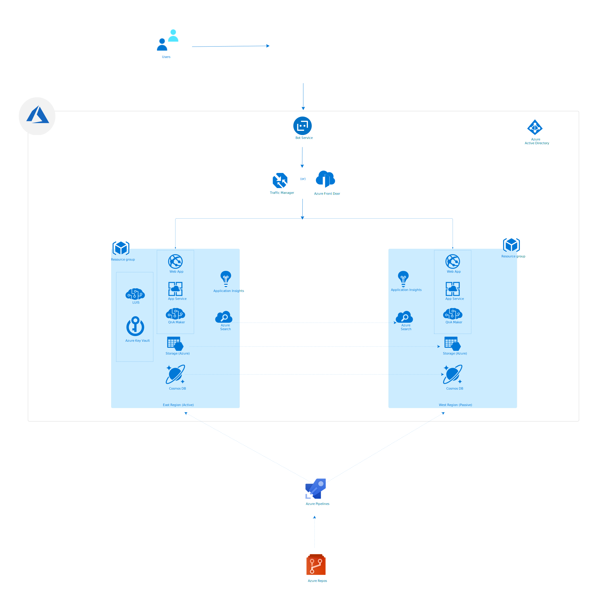

# Enterprise-grade conversational bot disaster recovery

[!INCLUDE [header_file](../header.md)]

A large enterprise architecture for SharePoint, Dynamics CRM, and Linux web servers hosted on an on-premises datacenter with failover to Azure infrastructure.

This solution is built on the Azure managed services: [Traffic Manager](https://azure.microsoft.com/services/traffic-manager/), [Azure Site Recovery](https://azure.microsoft.com/services/site-recovery/), [Azure Active Directory](https://azure.microsoft.com/services/active-directory/), [VPN Gateway](https://azure.microsoft.com/services/vpn-gateway/) and [Virtual Network](https://azure.microsoft.com/services/virtual-network/). These services run in a high-availability environment, patched and supported, allowing you to focus on your solution instead of the environment they run in.

## Architecture
The picture below shows some of the core components you should consider when building an enterprise-grade chatbot solution. You can find more details about each of these components under the context of chatbot in this documentation.

## Components
Above architecture blueprint shows how we can deploy a chatbot solution in Active/Passive mode for disaster recovery. Reference architecture includes only the core components of a typical chatbot solution in Azure.

* Non-regional services: Azure AD, Azure Bot Registration, Traffic Manager or Azure Frontdoor, Azure DevOps – Repos and Pipelines are nonregional services and you don’t need to do anything as these services are going to be available in the specific geographies regardless of any rare Azure region outage.

* Regional Services with automatic failover: Though you have to provision Azure KeyVault & LUIS to a specific Azure region, these services provide automatic failover to different Azure region and you don’t need to handle it. You can find more details about the high availability of these services in the following links Azure Key Vault availability and redundancy, LUIS regions and endpoints

* Regional Services without automatic failover: Now, let’s look at the services that need your attention. Details below cover all such services and recommendations for high availability.

1. Keep all of your deployment and source code artifacts in a source code repository and deploy two parallel of them in Azure paired regions. You can automate all of the next steps and can keep them part of your deployment artifacts. When you deploy these services, configure the bot API environment variables matching specific to the services in each region.
1. Keep the primary and secondary Azure search indexes in sync. Use the GitHub sample here to see how to backup-restore Azure indexes.
Back up the Application Insights using continuous export. Note that as of today Application Insights is not giving an option to import the exported telemetry to another Application Insights. You can export into a storage account and use it for further analysis.
1. Setup high availability for AzureCosmos Db. You can find the options and recommendations here.
4. Setup high availability for the Azure Storage Account. You can find the details for the same here.
5. Deploy the bot API and QnA maker into an app service plan in both regions.
6. Once the primary and secondary stacks have been set up, use traffic manager to configure the two endpoints and set up a routing method for both QnA Maker & bot API
7. You would need to create an SSL certificate for your traffic manager endpoint. Bind the SSL certificate in your App services.
8. Finally, use the traffic manager/Azure Frontdoor endpoint of QnA Maker in your Bot and use the traffic manager endpoint of bot API in the Azure Bot Registration bot endpoint.

## Next Steps
